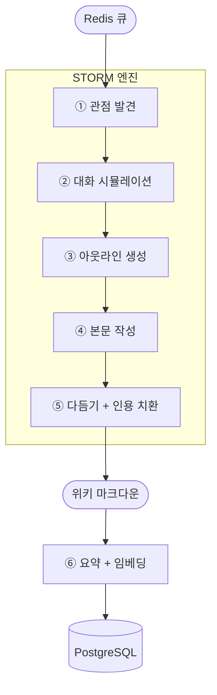

# HiveWiki Builder

HiveWiki Builder는 HiveWiki 캡스톤 프로젝트의 **AI 파이프라인 서비스**입니다.
Redis 큐로 전달된 학사 공지를 [STORM](https://github.com/stanford-oval/storm) 엔진으로 한국어 위키 문서로 변환하고,
원문 임베딩과 요약을 함께 PostgreSQL에 적재합니다.

> **담당 범위:** AI 파트 — 공지 한 건이 큐에 도착한 시점부터, 구조화된 위키 문서와 임베딩이 DB에 저장되기까지.

---

## 왜 STORM인가

학사 공지 한 건의 본문은 평균 ~500자로 짧고 정형적이지만,
"수강신청 안내"·"학점교류 안내"처럼 **같은 주제를 다루는 여러 공지가 학기마다 누적**됩니다.
이 본문을 그대로 노출하면 사용자는 비슷한 문서 여러 개를 따로 읽어야 합니다.

STORM은 다음 두 가지 성질이 이 도메인에 잘 맞습니다.
- **다관점 시뮬레이션** — 한 공지를 여러 가상 전문가 관점에서 질의·정리해 구조화된 섹션 문서로 만듭니다.
- **출처 추적성** — `[1]`, `[2]` 형식 인용을 보존하고, 후처리에서 실제 공지 링크(`hallym.ac.kr/...`)로 치환합니다.


---

## STORM 위키 생성 흐름

공지 한 건이 위키 문서로 만들어지기까지의 흐름입니다.



각 단계의 세부 동작은 다음과 같습니다.

1. **관점 발견** — Agent LM이 주제에 대한 가상의 전문가 관점들을 생성합니다 (`max_perspective=2`).
2. **대화 시뮬레이션** — 각 관점이 질문을 던지고, 커스텀 Retriever(`DBNoticeRetriever`)가 키워드 점수 기반으로 공지를 검색해 답변을 구성합니다 (`max_conv_turn=2`, `k=5`).
3. **아웃라인 생성** — 누적된 Q&A를 바탕으로 Agent LM이 문서 골격을 만들고, 영어 보일러플레이트 섹션(`References`, `See Also`, `Academic Sources` 등)은 후처리(`_clean_outline_placeholders`)로 제거합니다.
4. **본문 작성** — Synthesis LM(Claude)이 섹션별 본문을 한국어로 작성합니다. 영어 instruction이 LM에 그대로 전달되지 않도록 `ClaudeModel`의 `system` kwarg로 한국어 작성을 강제합니다.
5. **다듬기 및 인용 치환** — `runner.run(remove_duplicate=True)`로 lexical 중복을 제거한 폴리싱 본문을 받고, `[N]` 인용을 `url_to_info.json` 매핑으로 `[출처: 제목](URL)`로 치환합니다.
6. **요약 · 임베딩** — Agent LM이 위키 본문을 2~3문장으로 요약하고, OpenAI 임베딩으로 원문 벡터를 생성합니다.

산출물은 모두 PostgreSQL에 저장됩니다 — `wiki_documents`, `wiki_revisions`, `source_chunks`, `chunk_embeddings`.

### 커스텀 Retriever: `DBNoticeRetriever`

`dspy.Retrieve`를 상속한 폐쇄 도메인 검색기입니다.
질의어 토큰이 공지 `title` · `content` · `department`에 등장하는 횟수로 단순 점수화한 뒤 상위 `k`개를 반환합니다.

---

## LLM 구성

| 역할 | 모델 | 용도 |
|---|---|---|
| Agent LM | OpenAI `gpt-4o-mini` | 관점 시뮬레이션 · 질문 생성 · 아웃라인 · 요약 |
| Synthesis LM | Anthropic `claude-sonnet-4-6` | 본문 작성 · 다듬기 |
| Embedding | OpenAI `text-embedding-3-small` | 임베딩 (1536-dim) |

역할을 둘로 나눈 이유는 다음과 같습니다.
- **Agent LM**은 짧은 응답을 다수 호출하는 영역이라 빠르고 저렴한 모델이 적합합니다.
- **Synthesis LM**은 출력 품질이 최종 위키 품질을 좌우하므로 장문 한국어 생성에 강한 모델을 사용합니다.

모든 추론은 외부 API 호출입니다. 로컬 GPU나 임베딩 모델은 사용하지 않습니다.

---

## 알려진 한계

- **Hyperparameter 효과** — `max_conv_turn`, `max_perspective`, `STORM_RETRIEVER_K` 3종을 27개 조합으로 sweep한 결과, 품질 변동은 호출 자체의 비결정성보다 작았습니다 (`evaluation/REPORT.md`).
  → 현재 운영값은 STORM 원논문 권장 baseline인 `turn=2, perspective=2, k=5`로 채택.

---

## 실행

```bash
uv sync
uv run python consumer.py
```

`.env.example`을 복사해 `.env`를 작성한 뒤 실행합니다.
`main.py`는 더 이상 진입점이 아닙니다(실행 시 deprecation 메시지 후 종료).

Docker로도 실행할 수 있습니다.

```bash
docker build -t hivewiki-builder .
docker run --rm --env-file .env hivewiki-builder
```

---

## 개발 도구

**AI / 파이프라인**
- [knowledge-storm](https://github.com/stanford-oval/storm) — STORM 위키 생성 프레임워크
- [dspy](https://github.com/stanfordnlp/dspy) — 커스텀 Retriever(`DBNoticeRetriever`) 구현 베이스
- [openai](https://github.com/openai/openai-python) — Agent LM · 임베딩 호출
- [anthropic](https://github.com/anthropics/anthropic-sdk-python) — Synthesis LM 호출

**평가 / 분석**
- `evaluation/metrics.py` — A(인용 커버리지) + B(중복도) + C(섹션 균형) 정량 지표
- `evaluation/rubric.py` — Claude judge 5종 rubric 채점
- `evaluation/bench.py` — 하이퍼파라미터 sweep 러너

**런타임**
- Python 3.12
- redis-py — 큐 컨슈머
- psycopg2 — PostgreSQL 클라이언트

**개발 환경**
- uv — 의존성 관리
- pre-commit — Ruff(lint/format), gitleaks, commitizen, uv-lock
